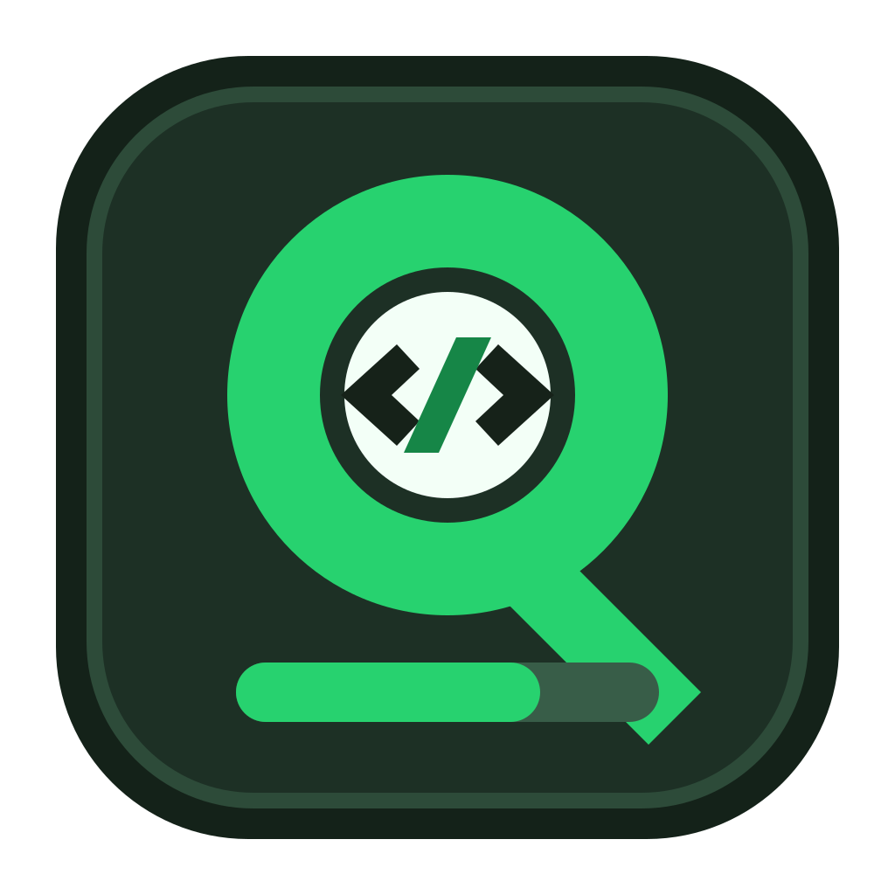
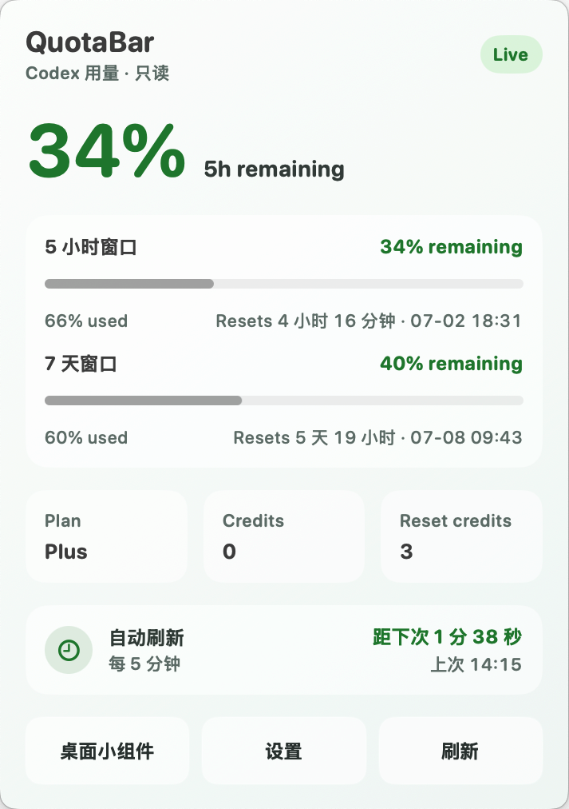
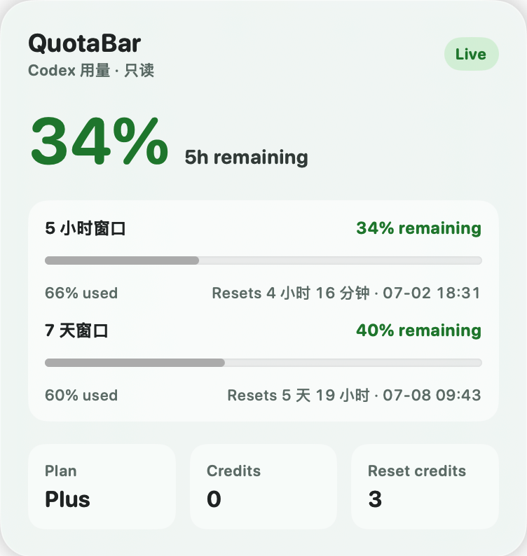
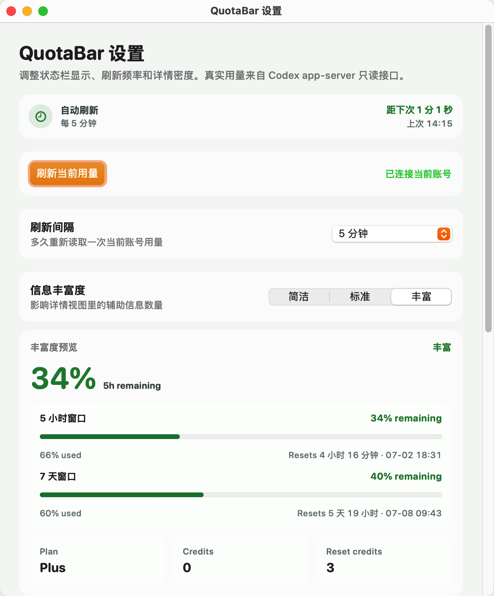

<div align="center">
  
  <h1>QuotaBar</h1>
  <p>把 Codex 剩余用量放进 macOS 菜单栏。</p>
  <p>
    <a href="README.md">English</a> · <strong>简体中文</strong>
  </p>
  <p>
    
    
    <a href="LICENSE"></a>
  </p>
</div>

QuotaBar 是一款轻量的 macOS 菜单栏工具，用于查看当前 Codex 账号的 5 小时与 7 天剩余用量、重置时间、Plan、Credits 和 Reset credits。它通过 Codex 提供的只读接口获取数据，不读取 Codex Desktop 的私有数据库，也不会执行额度重置或修改账号状态。

## 功能亮点

- **一眼查看额度**：在菜单栏紧凑展示 5h / 7d 剩余用量；5 小时限制临时停用时自动只显示有效的 7d 指标。
- **完整用量面板**：展示各用量窗口、重置时间、Plan、Credits、Reset credits 与刷新状态。
- **桌面小组件**：提供可显示、隐藏和吸附桌面的 App 内小组件。
- **灵活显示设置**：支持刷新间隔、信息丰富度、菜单栏密度、Codex 前缀、状态栏和 Dock 图标等选项。
- **开机启动**：可将 QuotaBar 注册为 macOS 登录项。
- **过期时间查询**：可在设置页手动查询全部 Reset credits 的过期时间。
- **实验性原生组件**：附带 WidgetKit 扩展；未签名构建不保证出现在 macOS 小组件库中。

## 应用截图

<table>
  <tr>
    <td align="center"><strong>菜单栏面板</strong></td>
    <td align="center"><strong>桌面小组件</strong></td>
  </tr>
  <tr>
    <td></td>
    <td></td>
  </tr>
</table>

<p align="center">
  <strong>设置</strong><br>
  
</p>

## 系统要求

- Apple Silicon Mac（当前构建脚本目标为 `arm64`）
- macOS 14 Sonoma 或更高版本
- 已安装并登录 ChatGPT 或旧版 Codex macOS App
- 从源码构建需要 Swift 6.2、Xcode Command Line Tools 与 ImageMagick

## 快速开始

目前请从源码构建。下载或克隆本仓库后，在项目根目录执行：

```bash
brew install imagemagick
Scripts/build-app.sh
open .build/QuotaBar.app
```

构建产物位于 `.build/QuotaBar.app`。如需使用开机启动或实验性原生小组件，请将 App 移到 `/Applications` 后再打开一次：

```bash
cp -R .build/QuotaBar.app /Applications/
open /Applications/QuotaBar.app
```

也可以直接通过 Swift Package Manager 运行主程序；这种方式不会生成完整的 `.app` 包和原生小组件扩展：

```bash
swift run CodexUsageWidgetApp
```

> [!NOTE]
> 当前构建使用 ad-hoc 签名，仅适合本地开发和试用。macOS 可能提示应用来自未识别的开发者；实验性 WidgetKit 组件也可能无法被系统收录。

## 使用方式

1. 确保 ChatGPT 或旧版 Codex App 已登录当前账号。
2. 启动 QuotaBar，菜单栏会显示当前有效的用量窗口。
3. 点击菜单栏文字查看详情、立即刷新或打开设置。
4. 在设置中调整显示密度、自动刷新、桌面小组件、Dock 图标和开机启动。

## 数据来源与隐私

QuotaBar 以只读方式使用以下数据源：

- 常规用量通过本机 ChatGPT / Codex App 内的 `codex app-server --stdio` 获取，调用 `account/rateLimits/read`。
- 只有在用户手动点击查询时，Reset credits 过期时间功能才会读取本机 Codex 登录凭据中的 access token，并向 ChatGPT 的只读接口发起请求。

QuotaBar 不读取 Codex Desktop 私有数据库，也不提供登录、购买、批准、拒绝或重置额度功能。它不会保存任务内容；应用设置和供 WidgetKit 展示的最近一次用量快照会写入 `Application Support/QuotaBar`，Reset credits 过期时间查询结果仅保留在当前运行会话中。

## 项目结构

```text
Sources/
├── CodexUsageCore/                  # 数据模型、格式化、设置和只读数据源
├── CodexUsageWidgetApp/             # SwiftUI / AppKit 菜单栏应用
└── CodexUsageNativeWidgetExtension/ # 实验性 WidgetKit 扩展
Tests/
├── CodexUsageCoreTests/             # 核心逻辑测试
└── BuildAppBundleIdentifierTests.sh # Bundle ID 回归测试
Scripts/
└── build-app.sh                     # App 打包脚本
```

## 开发与验证

```bash
zsh Tests/BuildAppBundleIdentifierTests.sh
swift test
swift build
Scripts/build-app.sh
```

主应用 Bundle ID 为 `org.dongx.quota.bar`，Widget 扩展 Bundle ID 为 `org.dongx.quota.bar.native-widget`。

提交改动前，请确保上述命令全部通过。功能实现与缺陷修复应遵循仓库中的 [AGENTS.md](AGENTS.md) 以及 `docs/superpowers/` 下已批准的设计和计划。

## 参与贡献

欢迎提交 Issue 和 Pull Request。请在 PR 中说明改动目的、验证方式，以及涉及界面时的前后截图；新增或修改的代码注释、文档注释和用户可见文案请使用中文。

## 开源协议

本项目基于 [Apache License 2.0](LICENSE) 开源，归属信息请参阅 [NOTICE](NOTICE)。
